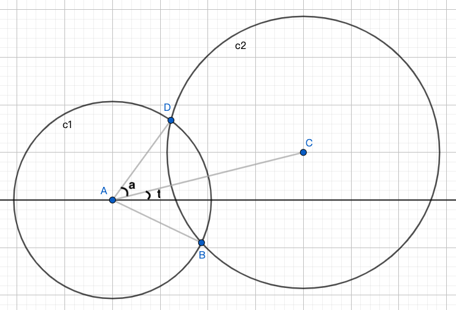

<!-- ---
export_on_save:
 html: true
--- -->

兩圓交點
---

求兩圓交點並不是一件很困難的事，畢竟國高中多多少少都有計算過，主要的問題是如何優雅地用程式求點。

---

**思路**

假設擁有兩圓座標及兩圓半徑，如何求出焦點？
- 解聯立方程式或許是一個直觀的作法，但在程式中，解聯立的程式寫起來是有點麻煩的，因此我不偏好這種解法
- 另一個解法就是用三角函數跟幾何，也是以下用的方法

---

**求交點**



在圖上，列出了$a$、$t$兩個角，其意義如下：
- $a$：兩圓心跟一個焦點的夾角，哪一個焦點沒有影響，因為對稱關係，角度相同
- $t$：圓心連線跟水平線的夾角

求出兩個角度後，基本上求焦點就沒有難度了，可觀察到 $t + a$ 跟 $t - a$ 分別代表圓心跟兩焦點的角度，同時擁有半徑，可用三角函數求出焦點。

因此問題在於如何求出$a$、$t$，方法如下：
- $a$：擁有三邊邊長，餘弦求角度
- $t$：兩圓心向量用$arctan$求角度

程式碼：

```c++
// 存儲座標或向量
struct NODE {
    double x, y;
    NODE() {}
    NODE(double x, double y) : x(x), y(y) {}
};

// 求出兩點距離平方
double disSq(NODE a, NODE b) {
    return (a.x - b.x) * (a.x - b.x) + (a.y - b.y) * (a.y - b.y);
}

// 計算t
double radT(NODE c1, NODE c2) {
    NODE c1c2 = NODE(c2.x - c1.x, c2.y - c1.y);
    return atan2(c1c2.y, c1c2.x);
}

// 計算a
double radA(NODE c1, double r1, NODE c2, double r2) {
    return acos((r1 * r1 + disSq(c1, c2) - r2 * r2) / (2 * r1 * sqrt(disSq(c1, c2))));
}

// 計算圓心到焦點向量
NODE polar(double a, double r) {
    return NODE(r * cos(a), r * sin(a));
}

// 輸入兩圓心跟半徑，求交點
vector<NODE> find(NODE c1, double r1, NODE c2, double r2) {
    vector<NODE> ret;

    // 判斷是否沒有交點
    if (sqrt(disSq(c1, c2)) > r1 + r2)
        return ret;

    double t = radT(c1, c2);
    double a = radA(c1, r1, c2, r2);

    NODE polar1 = polar(t + a, r1);
    NODE polar2 = polar(t - a, r1);

    ret.pb(NODE(c1.x + polar1.x, c1.y + polar1.y));
    // 判斷是否交於一點
    if (abs(a) > eps)
        ret.pb(NODE(c1.x + polar2.x, c1.y + polar2.y));
    return ret;
}
```