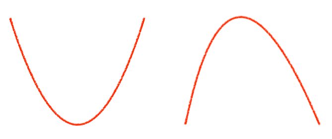
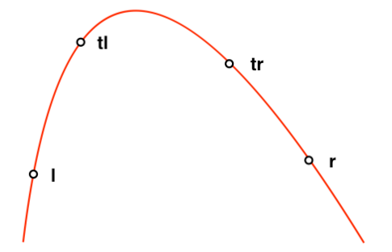

<!-- ---
export_on_save:
 html: true
--- -->

三分搜尋 / Ternary Search
---

三分搜尋是一個相對小眾的算法，用處在於找出**凸／凹形函數**的極值。
- 凸／凹形函數：只有單一頂峰的函數，依照開口不同分為凹形（左）、凸形（右）

  

- 操作：可在$log(n)$內找到區間極值

---

以下皆以凸形為例。

三分的概念近似二分，一樣是透過縮小範圍逼近答案的算法，只不過取點時分成三等份，並保證每次至少去除三分之一的區間。

以下先解釋三分的方法，再說明其正確性：
- 變數定義：
  - $[l, r]$：現在查詢的區間範圍
  - $tl$：距離$l$三分之一區間長的點
  - $tr$：距離$r$三分之一區間長的點

  

- 操作：$f(x)$為函數代入$x$的值
  - 若$f(tl) \geq f(tr)$，新區間為$[l, tr]$
  - 若$f(tl) < f(tr)$，新區間為$[tl, r]$
- 正確性：分項討論$tl, tr$可能的三種分布
  - 若$tl, tr$都在極值左端，則必然$tl < tr$，$[tl, r]$包含極值
  - 若$tl, tr$都在極值右端，則必然$tl > tr$，$[l, tr]$包含極值
  - 若$tl$在極值左端，$tr$在極值右端，則無論$tl, tr$大小關係，新區間都包含極值

---

**三分搜尋**

- 函數求值程式碼：
  ```cpp
  // n次函數
  // a[i]為x^i的係數
  int n;
  double a[14];

  // 計算函數代x的值
  double f(double x) {
      double ret = 0, cur = 1;
      for (int i = 0; i <= n; i++) {
          ret += cur * a[i];
          cur *= x;
      }
      return ret;
  }
  ```

- 三分程式碼：
  ```cpp
  // 精度
  const double eps = 1e-7;

  // [l, r]區間搜尋極值端點
  double ternary(double l, double r) {
      // 浮點數不相等，不能用==判別
      // 判斷精度，一般為題目要求多一位
      while (r - l > eps) {
          double tl = l + (r - l) / 3, tr = r - (r - l) / 3;
          if (f(tl) > f(tr))
              r = tr;
          else
              l = tl;
      }
      return l;
  }
  ```


