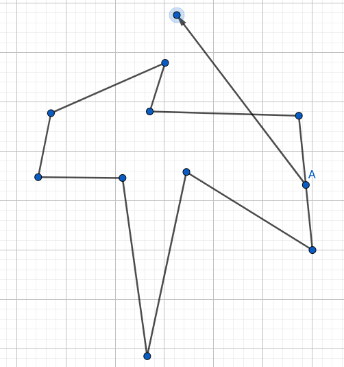

<!-- ---
export_on_save:
 html: true
--- -->

判斷點在多邊形內
---

**思路**

當多邊形限定為凸多邊形時，判斷一點是否在多邊形內部並不難，我們可以按順時針的順序，逐一將邊看作向量（如$EA$），並觀察向量起始點到被判斷點的向量（如$EF$）是否在其右側，若全部的邊都滿足此特性，則在多邊形內。


但若是一個任意多邊形，就沒辦法這樣判斷了，得透過**射線法**判斷。

首先觀察一個任意多邊形，可以發現從多邊形內一點往任意方向延伸一條射線，必有奇數個交點，而從外部一點出發，必有偶數個交點。

這個特性其實也可以直觀理解，每次相交必然代表進入／離開多邊形，而由於射線無限延伸，最後射線一定會到達多邊形外部，因此多邊形內部的點，在兩兩成對的進入／離開的相交外，自然會多一次離開多邊形的相交。

如圖，可發現射線與多邊形有三個交點，分別為離開、進入、離開。


---

**問題**

以上雖然簡單的說明**射線法**的依歸，但其實還有幾個特殊狀況需要解決：
1. 被判斷點在多邊形邊／點上，會導致交點數誤判

   
2. 射線與多邊形相交於多邊形頂點，會導致交點被計算兩次 

   
3. 射線與多邊形某邊斜率相同，相交無限多次

   

---

**解決**

上面提到提到了**射線法**遇到的問題，以下說明一種解決辦法：
1. 特判被判斷點在多邊形邊／點上的狀況，如果在，則不必計算交點數，直接返回結果
2. 相交於頂點時，設定特殊的計算條件，如只有相交於向量起始頂點時，才計算交點，避免重複計算
3. 如果射線與邊斜率相同，則直接忽略，因為不可能進入／離開多邊形

---

**程式碼**

```c++
// 儲存點、向量
struct point {
    double x, y;
    point() {}
    point(double x, double y) : x(x), y(y) {}
    point operator+(const point &a) const {
        return point(x + a.x, y + a.y);
    }
    point operator-(const point &a) const {
        return point(x - a.x, y - a.y);
    }
    // 內積
    double operator*(const point &a) const {
        return x * a.x + y * a.y;
    }
    // 外積
    double operator^(const point &a) const {
        return x * a.y - a.x * y;
    }
};

double eps = 1e-8;

// 判斷值是否大於0，避免浮點數偏差
int dcmp(double x) {
    if (x < -eps)
        return -1;
    return x > eps;
}

// 判斷點是否在線上
bool pointOnLine(point a, point b, point p) {
    return dcmp((a - p) ^ (b - p)) == 0 && dcmp((a - p) * (b - p)) <= 0;
}

// 判斷點是否多邊形內部
bool chk(point p, vector<point> &points) {
    int ans = 0, k, d1, d2;
    for (int i = 0; i < points.size(); i++) {
        point a = points[i], b = points[(i + 1) % points.size()];

        // 特盼
        if (pointOnLine(a, b, p))
            return true;
        k = dcmp((b - a) ^ (p - a));
        d1 = dcmp(a.y - p.y);
        d2 = dcmp(b.y - p.y);
        // 這裡的等號是避免問題2的重複計算
        if (k > 0 && d1 <= 0 && d2 > 0)
            ans++;
        else if (k < 0 && d2 <= 0 && d1 > 0)
            ans++;
    }
    // 奇數交點則在內部
    return ans % 2;
}
```