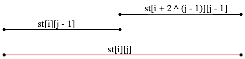

<!-- ---
export_on_save:
 html: true
--- -->

st表 / 稀疏表
---

st表是一種用來處理**區間最值**的資料結構，可以在$O(nlogn)$內完成**預處理**，並以$O(1)$複雜度做**區間查詢**。

橫向比較樹狀數組、分塊算法跟線段樹，可發現st表不能做改值的操作，但可在常數時間內查詢，因此適合查詢次數極多的場合。

---

以下皆以維護區間最大值的st表為例。

st表基本上是基於**倍增**思想的資料結構，使用一個二維數組$st$儲存預處理資料。

$st[i][j]$的意義：
- 維護$i$開始，長$2 ^ j$區間的最大值
- 換言之，$[i, i + 2 ^ j)$的最大值

---

#### 預處理計算$st$

由$st$定義可發現：
- 長度為$1$的區間，最大值自然就是自己
- 長度為$2 ^ j$的區間，可由兩個長度為$2 ^ {j - 1}$的區間組合而成
- 對於區間$[i, i + 2 ^ j)$，可由$[i, i + 2 ^ {j - 1})$、$[i + 2 ^ {j - 1}, i + 2 ^ j)$兩個區間求得
- 上述區間可用$st$數組表示如下圖

  

以公式表示：
- $st[i][0] = a[i]$
- $st[i][j] = max(st[i][j - 1], st[i + 2 ^ {j - 1}][j - 1])$

預處理程式碼：
```cpp
// lg2[]可以先忽略，在區間查找時才會用到
int lg2[MAXN], st[MAXN][21], a[MAXN];

void pre(int n) {
    for (int i = 2; i <= n; i++)
        lg2[i] = lg2[i / 2] + 1;
    // 對長度為1的區間做處理
    for (int i = 1; i <= n; i++)
        st[i][0] = a[i];
    // 由長度較短的區間開始處理，可保證處理st[i][j]時，st[k][j - 1]已經處理好了
    for (int i = 1; i < 21; i++)
        for (int j = 1; j <= n; j++) {
            // 當j + (1 << i) - 1超過數組長度，不必繼續操作
            if (j + (1 << i) - 1 > n)
                break;
            // 剛推出的公式
            st[j][i] = max(st[j][i - 1], st[j + (1 << (i - 1))][i - 1]);
        }
}
```

複雜度分析：
- 前面的初始化複雜度皆為$O(n)$
- 數組長度為$n$，$j$最大$logn$，因此兩層迴圈為$O(nlogn)$

--- 

#### 區間查詢

首先舉個例子，思考一下查詢的狀況。

- 查詢區間$[1, 7]$：
  - $st$中的區間大小皆為$2$的冪次，顯然沒有辦法直接找到對應的區間
  - 試著拆成兩個區間，$[1, 4]$、$[3, 7]$皆在$st$中，且其聯集可表示區間$[1, 7]$
- 查詢區間$[3, 14]$：
  - 可拆成$[3, 10]$、$[7, 14]$

觀察例子可知，我們可將原本未必為$2$的冪次的區間，依以下規則拆成兩個符合條件的區間。
- 前一個區間為$[l, l + 2 ^ s - 1]$，$l + 2 ^ s - 1$盡量接近$r$
- 後一個區間為$[r - 2 ^ s + 1, r]$，$r - s ^ s + 1$盡量接近$l$
- 按照條件列出公式（以前一個區間為例）：
  $l + 2 ^ s - 1 \leq r$
  $2 ^ s \leq r - l + 1$
  $s \leq log_2(r - l + 1)$
- 由於$s$為整數，$log_2(r - l + 1)$需向下取底

由於每次運算$log$會拖慢$O(1)$的時間，因此在預處理中先建立數組，儲存每一個數對應的$log$。

剛剛預處理跳過的程式碼：
```cpp
for (int i = 2; i <= n; i++)
    lg2[i] = lg2[i / 2] + 1;
```

區間查詢程式碼：
```cpp
int query(int l, int r) {
    int len = r - l + 1;
    return max(st[l][lg2[len]], st[r - (1 << lg2[len]) + 1][lg2[len]]);
}
```