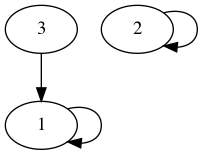
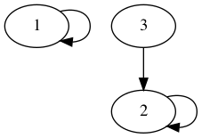
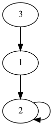
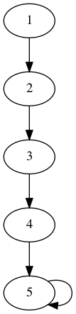
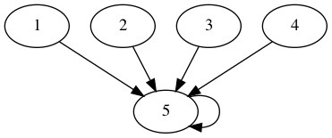

<!-- ---
export_on_save:
 html: true
--- -->

並查集與種類並查集
---

並查集，是一種關於集合的資料結構，支援兩種操作：
- 合併：將兩個不交集的集合合併成一個
- 查詢：判斷兩個元素是否屬於同一集合

---

這樣的定義或許有些抽象，我們簡單舉一個情境來說明並查集的用處。

> 問題描述：
> 有$n$名山賊，有$m$條線索，每條線索告訴你有兩個山賊屬於同一個山寨，問共有幾個山寨。

顯然，上述便是一個可用並查集解決的典型問題，首先將每個山賊視為一個擁有一個元素（他自己）的集合，接下來對每條線索，將兩名山賊所在的集合合併，最後剩餘集合數量即為答案。

--- 

了解並查集的用處後，自然要知道如何實作，並查集的重點在於**用集合中的一個元素代表該集合**，以上題為例，可以想像成每個山寨我們以山賊頭目做為代表。

為簡化問題，我們簡單粗暴的假設有五名盜賊，一開始每個集合只有自己，因此每個集合的代表（頭目）也是自己，初始化如下。

- $id$為山賊編號，$f[id]$為頭目編號

  | id   |   1 |   2 |   3 |   4 |   5 |
  | ---  | --- | --- | --- | --- | --- |
  | f[id]|   1 |   2 |   3 |   4 |   5 |

- 如果第一個線索是$(1, 3)$在同一個山寨中，我們可以想像成山賊$1$吞併了山賊$3$的山寨，因此山賊$3$的頭目需更新

  | id   |   1 |   2 |   3 |   4 |   5 |
  | ---  | --- | --- | --- | --- | --- | 
  | f[id]|   1 |   2 |   1 |   4 |   5 |

- 接著處理$(2, 3)$，或許有人會想要直接更新成$f[3] = 2$，但這會使得山賊$3$跟山賊$1$的從屬關係消失，因此我們更新時，應**擒賊先擒王**的把山賊$3$的最上層首領歸屬於山賊$2$，才不會使關係消失

  | id   |   1 |   2 |   3 |   4 |   5 |
  | ---  | --- | --- | --- | --- | --- | 
  | f[id]|   2 |   2 |   1 |   4 |   5 

  - 原山賊關係
    
    

  - 錯誤更新的山賊關係（$1, 3$關係消失）
    
    
  
  - 擒賊先擒王得山賊關係
    
    

講到這已經說明了合併集合的操作，至於確定兩元素是否屬於同一集合，只需用檢查其最上層頭目是否相同，相同則為同集合，反之則否。

---

#### 效率問題：路徑壓縮

每次合併與查詢時，皆需要檢查最上層頭目，若今天的關係為一條串列，則每次查詢都需要$O(n)$的時間，參考$n = 5$的下圖



若要檢查$1$的最上層頭目，每次都要跑一次所有關係，才能找到首領$5$，因此我們設想在檢查的同時，將圖簡化成兩層的圖型



顯然，上述兩圖的概念是相同的（大頭目皆為$5$），但下圖將所有的查詢速度增加到了一次。

---

至此，並查集的觀念算是講完了，以下附上代碼實作。

- 初始化
  ```c++
  // 一開始頭目都是自己
  void init(int n) {
      for (int i = 1; i <= n; i++)
          anc[i] = i;
  }
  ```

- 查找大頭目
  ```cpp
  // 大頭目的頭目是自己本身，若不是，則繼續向上查找
  // 找到大頭目後，將路徑上的端點頭目都改成大頭目（路徑壓縮）
  int findAnc(int cur) {
      return cur == anc[cur] ? cur : anc[cur] = findAnc(anc[cur]);
  }
  ```

- 合併
  ```cpp
  // 將a的大頭目的頭目設為b的大頭目
  void merge(int a, int b) {
      anc[findAnc(a)] = findAnc(b);
  }
  ```

---

種類並查集，是一般並查集的擴展，用來維護更複雜的關係。

- 敵人的敵人是朋友
  - 建構$anc[2n + 1]$的數組
  - $anc[a]$代表$a$的朋友的集合
  - $anc[a + n]$代表$a$的敵人的集合
  - 若$(a, b)$為敵人，合併$(a, b + n)$、$(a + n, b)$
  - 若$(a, b)$為朋友，合併$(a, b)$、$(a + n, b + n)$

- 種類並查集有許多常見的問題，如食物鏈關係等，在此不贅述


