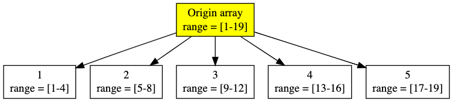
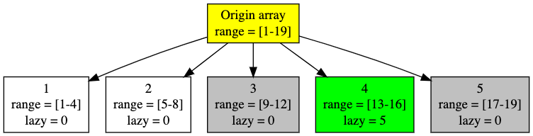

<!-- ---
export_on_save:
 html: true
--- -->

分塊
---

分塊是一種維護**區間特徵**跟**區間修改**的資料結構，優點在於簡單易懂的邏輯與適應各種問題的彈性。

常見的分塊應用：
| 處理問題                 | 補充說明               | 預處理                | 區間查詢                    | 區間修改        |
| ---                     | ---                  | ---                  | ---                        | ---           | 
| 區間和                   | 無                    | $O(n)$              | $O(\sqrt{n})$              | $O(\sqrt{n})$ |
| 區間極值                 | 無                    | $O(n)$               | $O(\sqrt{n})$             | $O(\sqrt{n})$ |
| 區間小於$k$的元素數量      | $k$不固定，每次查詢可不同 | $O(nlog(\sqrt{n}))$ | $O(\sqrt{n}log(\sqrt{n}))$ | $O(\sqrt{n}log(\sqrt{n}))$ |
| 區間屬於$[a, b]$的元素數量 | $[a, b]$不固定         | $O(nlog(\sqrt{n}))$ | $O(\sqrt{n}log(\sqrt{n}))$ | $O(\sqrt{n}log(\sqrt{n}))$ |
| 區間眾數                 | 區間內出現次數最多的數    | 從缺                 | 從缺                       | 從缺 |

- 由於區間眾數我並沒有用分塊實作過（用莫隊離線做的），因此不確定複雜度可以壓到多少，列出僅是為了說明分塊可做
- 線段樹維護的性質需要滿足**結合率**，分塊則不用

---

分塊的基本概念是將長度為$n$的數列，分成$a$個長度為$\frac{n}{a}$的區塊，並透過維護每個區塊的特徵值，實現較快的區間查詢與修改。

以區間和為例：
- 預處理：將數列分成$a$塊並維護每塊的和
- 區間查詢：
  - 若查詢區間涵蓋完整的區塊，則直接加上預處理計算過的該區塊和
  - 對於不完整的部分，掃一遍暴力計算
  - 複雜度：$O(a + \frac{n}{a})$
- 區間修改：（懶標記，類似於線段樹的概念）
  - 若修改區間涵蓋完整的區塊，則直接在該區塊上打上應該修改但還未修改的懶標記
  - 對於不完整的部分，掃一遍暴力修改，並維護區塊和
  - 複雜度：$O(a + \frac{n}{a})$

**區間操作複雜度**解釋：最多包含$a$個區塊（總共只有這麼多），且不完整的部分只可能是區間最左、最右的兩個地方，每個部分不會長於$\frac{n}{a}$

顯然不難推出，當$a$為$\sqrt{n}$時，區塊數量$a$跟區塊長$\frac{n}{a}$都為$\sqrt{n}$，複雜度有最小值。

---

上面的描述或許有些抽象，以下舉例說明。

假設我們有一個長度為$19$的數列，我們現在對它進行分塊，因為$\sqrt{19}$不為整數，因此我們向下取底，將它分為每個長$\lfloor \sqrt{19} \rfloor$的區塊，有不足的也分成為一個區塊。



查詢$[3, 16]$的區間和，可以透過區塊如下運算：
- 綠色分塊的對應區間被完整的涵蓋，因此直接取處理好的和
- 灰色分塊被部分涵蓋無法使用分塊和，因此掃一遍$[3, 4]$計算和


修改將$[11, 18]$的區間加$5$，可以透過區塊如下運算：
- 綠色分塊的對應區間被完整的涵蓋，因此直接打上標記（之後取用時要加上標記乘上區塊長）
- 灰色分塊被部分涵蓋無法使用分塊和，因此掃一遍更改值（區塊和要同時更改）



---

#### 預處理

- 對每一個分塊，計算開始及結束的下標
- 計算分塊和
- 計算數列中每一個元素屬於哪個分塊

預處理程式碼：
```cpp
// n 數列長度
void pre(int n) {
    // sq 每個分塊的長度
    // cnt 分塊的數量（加上sq - 1是為了向上取整）
    // st[i] 第i個分塊起始下標
    // en[i] 第i個分塊結束下標
    int sq = sqrt(n), cnt = (n + sq - 1) / sq;
    for (int i = 1; i <= cnt; i++) {
        st[i] = (i - 1) * sq + 1;
        en[i] = i * sq;
    }
    // 最後一個分塊長度未必為sq，但一定在最後一個數結束
    en[cnt] = n;
    for (int i = 1; i <= cnt; i++)
        for (int j = st[i]; j <= en[i]; j++) {
            // sum[i] 第i個分塊的和
            // be[j] 元素j所屬的分塊
            sum[i] += a[j];
            be[j] = i;
        }
}
```

---

#### 區間查詢

查詢$[x, y]$：
- 左右端點在同一區間（$be[x] == be[y]$），暴力求和
- 左右端點不在同一區間（$be[x] != be[y]$）
  - 最左邊不完整掃一邊，數列區間$[x, en[x]]$
  - 最右邊不完整掃一邊，數列區間$[st[y], y]$
  - 中間的區塊直接取值，區塊區間$[be[x] + 1, be[y] - 1]$
- 取區塊和時，要加上懶標記乘以區間長
- 暴力取值時，要加上懶標記

區間查詢程式碼：
```cpp
// 查詢[x, y]的區間和
ll query(int x, int y) {
    ll ret = 0;
    // 若x, y屬於同一區間，掃一遍
    if (be[x] == be[y]) {
        for (int i = x; i <= y; i++)
            ret += a[i] + lazy[be[i]];
        return ret;
    }
    // 掃左邊不完整的部分
    for (int i = x; i <= en[be[x]]; i++)
        ret += a[i] + lazy[be[i]];
    // 掃右邊不完整的部分
    for (int i = st[be[y]]; i <= y; i++)
        ret += a[i] + lazy[be[i]];
    // 中間完整區塊部分直接取用
    for (int i = be[x] + 1; i <= be[y] - 1; i++)
        ret += sum[i] + (en[i] - st[i] + 1) * lazy[i];
    return ret;
}
```

---

#### 區間修改

邏輯與區間查詢相同。

區間修改程式碼：
```cpp
void update(int x, int y, ll k) {
    if (be[x] == be[y]) {
        for (int i = x; i <= y; i++) {
            a[i] += k;
            sum[be[i]] += k;
        }
        return;
    }
    for (int i = x; i <= en[be[x]]; i++) {
        a[i] += k;
        sum[be[i]] += k;
    }
    for (int i = st[be[y]]; i <= y; i++) {
        a[i] += k;
        sum[be[i]] += k;
    }
    for (int i = be[x] + 1; i <= be[y] - 1; i++)
        lazy[i] += k;
}
```

---

分塊的變形：
- 區間極值：
  - 區塊特徵為區塊極值
  - 每次更新時，不完整的部分更新完要再掃一遍找極值
  - 取區塊極值時，極值為存的極值加上懶標記
- 區間小於$k$的元素數量：
  - 不用儲存區塊特徵
  - 預處理時每個區塊排序一次，當查詢一個區塊比$k$小的元素時，二分搜搜尋，若有懶標記，則變成找比$k - lazy$小的元素
- 區間屬於$[a, b]$的元素數量：
  - 與上一個作法近似，轉換成成所有元素去掉比$a$小、比$b$大的元素
- 區間眾數：
  - 未用分塊實作
  - 記於莫隊筆記
