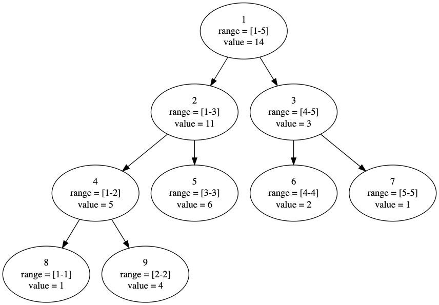
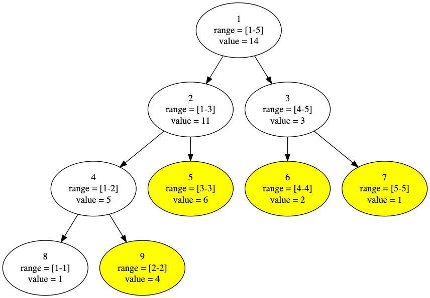
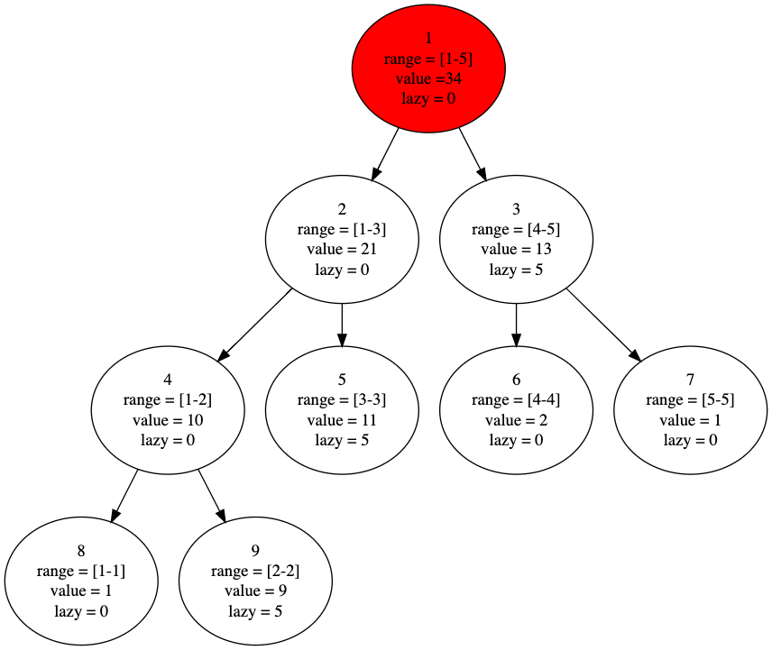
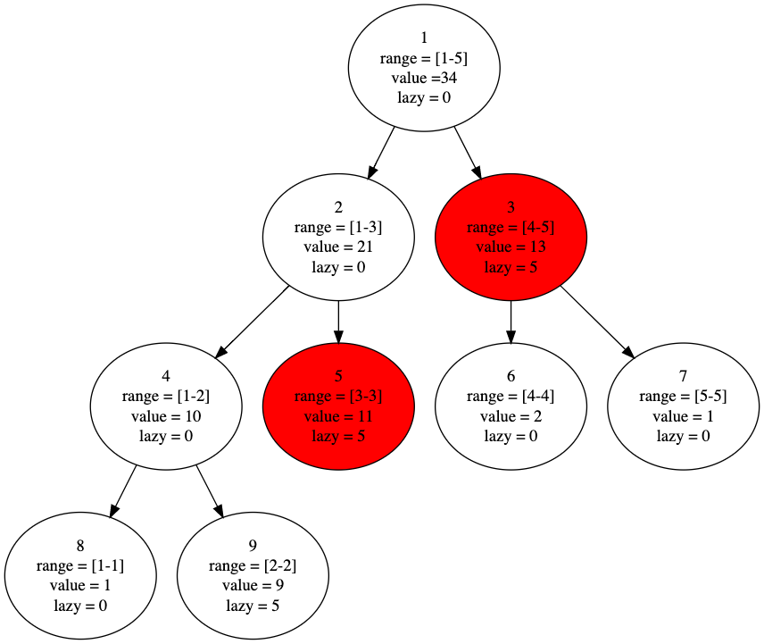
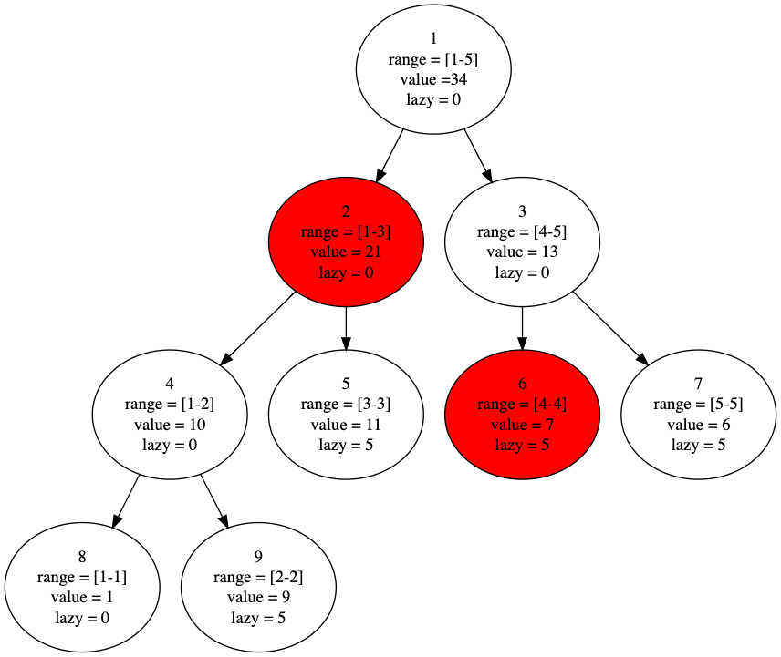

<!-- ---
export_on_save:
 html: true
--- -->

線段樹 / Segment Tree
---

線段樹一般用來維護**滿足結合律的區間信息**，如區間和、區間乘積等，其優於樹狀數組的地方在於，可以處理**區間修改**，缺點是實現比較繁雜，不像樹狀數組可以在不壓行的情況下，以差不多十行的長度實現。

順帶一提，有不少線段樹的問題可以用分塊來做，雖然複雜度掉到$O(n^{3/2})$（可區間改值的區間和為例），但依然足夠快，重點是實作較為快速。

接下來說明皆以區間和的線段樹為例，主要操作如下：
- 區間查詢：查詢區間內元素的和，$O(logn)$
- 區間修改：更改區間內元素的值（一般為加上某數$x$），$O(logn)$

---

線段樹是一顆**平衡二叉樹**，每一個節點代表一個區間的和，每向下一層，子結點區間為母節點區間的一半，當一節點區間大小為$1$時，沒有子節點，該節點的區間和即為自己的值。

根據定義，假設我們有一個長度為$5$的數組$[1, 4, 6, 2, 1]$，我們可畫出其線段樹如下圖。

圖中每個節點第一行的數字為節點編號，$range$為區間範圍、$value$為該區間和。



如圖可看出，區間為$[l, r]$的節點$i$的左右子節點分別為$2i$, $2i + 1$，左子節點的區間為$[l, \frac{(l + r)}{2}]$，右子節點的區間為$[\frac{(l + r)}{2} + 1, r]$。

---

#### 初始化線段樹

在查詢與修改前，我們必須依照原數組建構出一棵線段樹，而一般我們採用遞歸的方式建構。

遞歸條件：
- 當區間大小不為$1$時，繼續往下建構子節點
- 若區間大小為$1$，停止建構子節點，並將該節點的區間和設為自己的值
- 當子節點建構完成後，該節點區間和等於子節點區間和的和

初始化相關的程式碼：
- 方便使用的定義：
  ```cpp
  // lid 左節點編號 = 母節點 * 2
  // rid 右節點編號 = 母節點 * 2 + 1
  // 用位運算的方式節省時間
  #define lId (id << 1)
  #define rId (id << 1 | 1)
  ```
- 線段樹的結構體：
  ```cpp
  struct segmentTree {
      int l, r;           // 該節點區間
      ll lazy;            // 懶標記（還未提到，可先忽略）
      ll sum;             // 區間和
      inline int len() {  // 計算區間長度
          return r - l + 1;
      } 
  } tree[MAXN * 4]        // 線段樹節點數量不會多於區間大小的四倍
  ```
- 向上更新：
  ```cpp
  // 由於我們先確定的區間和是最底層節點的區間和（區間為1），因此上層節點的區間和要由下層相加而得
  void pushUp(int id) {
      tree[id].sum = tree[lId].sum + tree[rId].sum;
  }
  ```
- 建構線段樹：
  ```cpp
  // id 所要建構的節點編號
  // bl 所要建構的區間的左端點
  // br 所要建構的區間的右端點
  void build(int id, int bl, int br) {
      // 設定當前節點的區間
      tree[id].l = bl;    
      tree[id].r = br;
      tree[id].lazy = 0;

      // 若區間大小為1，停止遞迴 
      if (bl == br) {
          tree[id].sum = a[bl];
          return;
      }

      // 若不為1，向下建構
      int mid = (bl + br) >> 1;
      build(lId, bl, mid);
      build(rId, mid + 1, br);
      // 建構完子節點，該節點區間和為子節點的區間和相加
      pushUp(id);
  }
  ```

---

#### 區間修改

了解線段樹的結構後，一個直覺的區間修改方式便是遞迴到符合區間要求的葉節點，改值後再用$pushUp()$更新線段樹，如下圖更改$[2, 5]$的區間，便可透過更改黃色節點與更新完成區間修改。



但仔細想想，不難發現這樣的複雜度是難以承受的，事實上，其複雜度為$O(nlogn)$，因為最底層節點數為$O(n)$，向下遞迴到葉節點複雜度為$O(logn)$。

因此我們在此引入懶標記的概念，它的作用在於更新時不用更新至最底層，可以在上層偷懶，標記未更新完成的部分。

假設我們要對$[2, 5]$的區間加$5$，透過懶標記，我們可以如此操作。


如上圖，我們在更新時，更新了紅色節點的值（加上$5 * 2$），但卻沒有向下遞迴，而是打上一個懶標記，意指其子節點區間都要加$5$，但現在懶得做。黃色節點也是一樣的狀況，只不過因為葉節點沒有子節點的緣故，其實下方並不存在未更新的節點。

透過懶標記，我們可以更早地結束遞迴，而不用一路往下走到葉節點，並將複雜度優化到了$O(logn)$。

區間修改相關的程式碼：
- 向下更新：
  ```cpp
  // 將懶標記向下更新一層
  // id 現在所在的節點編號
  void pushDown(int id) {
      // 若懶標記為0，自然不需更新
      if (!tree[id].lazy)
          return;
      // 向下更新一層後，下下層仍未更新，因此下層的懶標記要更改
      tree[lId].lazy += tree[id].lazy;
      tree[rId].lazy += tree[id].lazy;

      // 更新下層的值
      tree[lId].sum += tree[id].lazy * tree[lId].len();
      tree[rId].sum += tree[id].lazy * tree[rId].len();

      // 更新完成，此節點懶標記歸零
      tree[id].lazy = 0;
  }
  ```
- 區間修改：
  ```cpp
  // id 現在所在的節點編號
  // ul 要更新的區間的左端點
  // ur 要更新的區間的右端點
  // value 區間加上的值
  void updateInterval(int id, int ul, int ur, ll value) {
      int l, r;
      l = tree[id].l;
      r = tree[id].r;

      // 若現在節點的區間完全屬於要更新的區間，可更新現在節點的值，並打上懶標記後結束遞迴
      if (ul <= l && r <= ur) {
          // 區間和，該節點加上的值為value * 區間長度
          tree[id].sum += value * tree[id].len();
          tree[id].lazy += value;
          return;
      }

      // 若要向下遞迴，則先把此層的懶標記向下更新一層（不會增加複雜度，因原本就要向下遞迴）
      pushDown(id);
      int mid = (l + r) >> 1;
      // 若更新的區間左端點小於左節點的區間右端點，則明顯需向左節點更新
      if (ul <= mid)
          updateInterval(lId, ul, ur, value);
      // 同理
      if (ur > mid)
          updateInterval(rId, ul, ur, value);
      // 子節點處理完仍要向上更新
      pushUp(id);
  }
  ```

---

#### 區間查詢

區間查詢概念跟區間修改相同，一樣是盡可能早返回，因此若一節點區間屬於要查詢的區間，便不用向下繼續遞迴。

延續前圖，數組為$[1, 9, 11, 7, 6]$，節點$3$有懶標記為更新，舉幾個查詢的區間方便理解：
- 查詢$[1, 5]$，返回紅色節點的值之和

  

- 查詢$[3, 5]$，返回紅色節點的值之和

  

- 查詢$[1, 4]$，在節點$3$需要向下查詢，因此先$pushDown()$更新再遞迴

  

區間查詢程式碼：
- 區間查詢：
  ```cpp
  // id 現在所在的節點編號
  // ql 要查詢的區間的左端點
  // qr 要查詢的區間的右端點 
  ll query(int id, int ql, int qr) {
      int l, r;
      l = tree[id].l;
      r = tree[id].r;

      // 若一區間完全屬於查詢的區間，則不用向下查找
      if (ql <= l && r <= qr)
          return tree[id].sum;

      // 向下查找之前，須向下更新，避免得到的值是未完成更新的部分
      pushDown(id);
      ll ret = 0;
      int mid = (l + r) >> 1;
      if (ql <= mid)
          ret += query(lId, ql, qr);
      if (qr > mid)
          ret += query(rId, ql, qr);

      return ret;
  }
  ```

---

線段樹還可以做各種符合結合率的區間問題，最常用的除了區間和就是區間極值，可由區間和模板輕易更改而成，因此不做贅述。