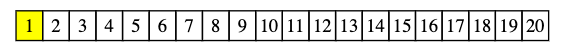
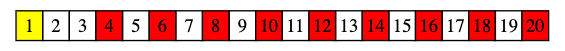
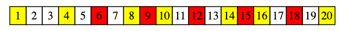
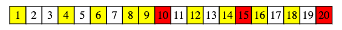
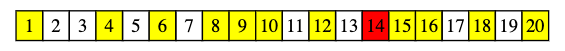
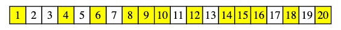

<!-- ---
export_on_save:
 html: true
--- -->

質數篩法
---

質數篩法，顧名思義是一種篩選出質數的演算法，用途在於快速有效的找出$[1, n]$中的質數。

---

**埃式篩法**

複雜度：$O(nloglogn)$

篩法原理：
- 找到的$[1, n]$的質數，其實就是刪掉$[1, n]$內所有的合數（非質數）
- 所有合數都存在至少一個小於該合數的質數
- 若對每個質數，將其倍數刪除，可刪除所有合數，留下質數

因此，只要我們從小到大遍歷每個數，若遍歷到某數時該數仍未被標記的話，則該數為質數，將該數所有倍數標記為合數，那麼程式結束未被標示的數即為質數。

---

以$[1, 20]$為例：
- 由於$1$不是質數，所以先標示起來
  
- 找到下一個未被標示的數$2$，標示其倍數
  
- 找到下一個未被標示的數$3$，標示其倍數
  
- 找到下一個未被標示的數$5$，標示其倍數
  
- 找到下一個未被標示的數$7$，標示其倍數
  
- 依序處理$11$、$13$、$17$、$19$，最後可得
  
- 未被標示（刪掉）的數即為質數

---

**一些簡單的優化**
- 標示質數的倍數時，可從質數的平方開始
  - 更小的數已被前面的質數標示過
  - 舉例：標示$5$時，可從$25$向後標示，因為$10$已被$2$標示過，$15$已被$3$標示過
- 僅需要處理到$\sqrt{n}$
  - 因為$n$的最小質因數（假設$n$不為質數），必定小於$\sqrt{n}$

---

埃式篩程式碼：

```cpp
#define MAXN 100000001

// 儲存質數
vector<int> p;
// 標記合數
vector<bool> mark(MAXN, 0);

// 找出[1, n]的質數
void isPrime(int n) {
    // 先把1特判掉
    mark[1] = 1;
    // 刪除質數的倍數
    for (int i = 2; i <= sqrt(n); i++)
        if (!mark[i]) {
            p.pb(i);
            // 由i * i開始刪，減少重複標示
            for (ll j = 1LL * i * i; j <= 1LL * n; j += i)
                mark[j] = 1;
        }
    // 將大於sqrt(n)的質數存入p
    for (int i = sqrt(n) + 1; i <= n; i++)
        if (!mark[i])
            p.pb(i);
}
```

---

**線性篩法**

複雜度：$O(n)$

篩法原理：
- 埃式篩做了大量重複標記的動作，若要加快，可以考慮對每個合數只標記一次
- 任一合數可表示成唯一的等式：合數 $=$ 最小質因數 $\times x$
- 嘗試透過$x$來標示合數，使每個合數只被標記一次

我們可以對每個數刪掉其質數倍，直到遇到該數的最小質因數，這樣的操作使得每個合數只被標記一次，達到線性複雜度。

---

線性篩程式碼：

```cpp
#define MAXN 10000000

vector<int> p;
vector<bool> mark(MAXN, 0);

void isPrime(int n) {
    mark[1] = 1;
    for (int i = 2; i <= n; i++) {
        if (!mark[i])
            p.pb(i);
        for (int j = 0; i * p[j] <= n; j++) {
            mark[i * p[j]] = 1;
            // 判別最小質因數
            if (i % p[j] == 0)
                break;
        }
    }
}
```


